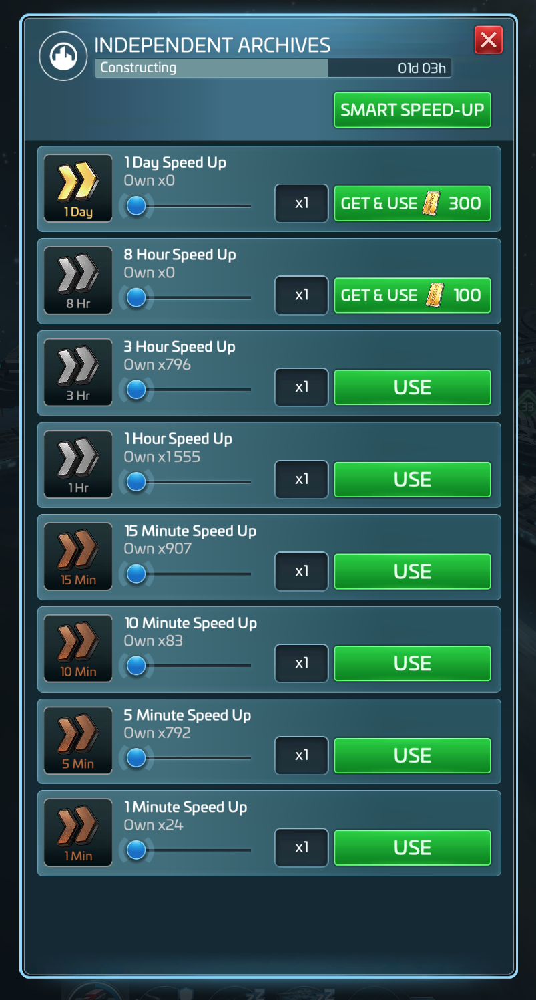
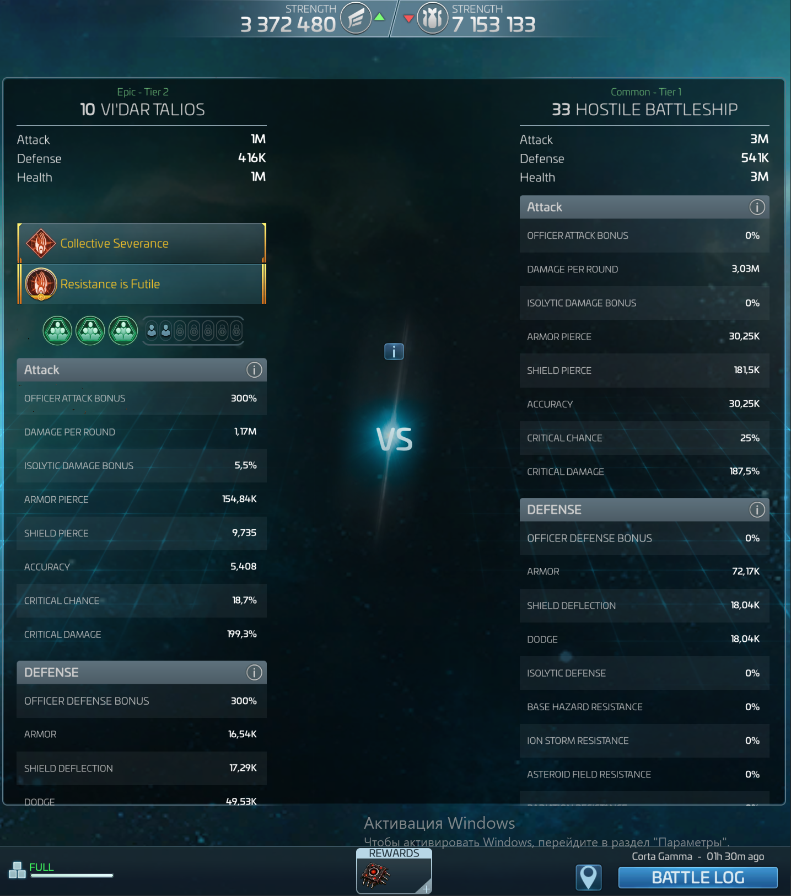
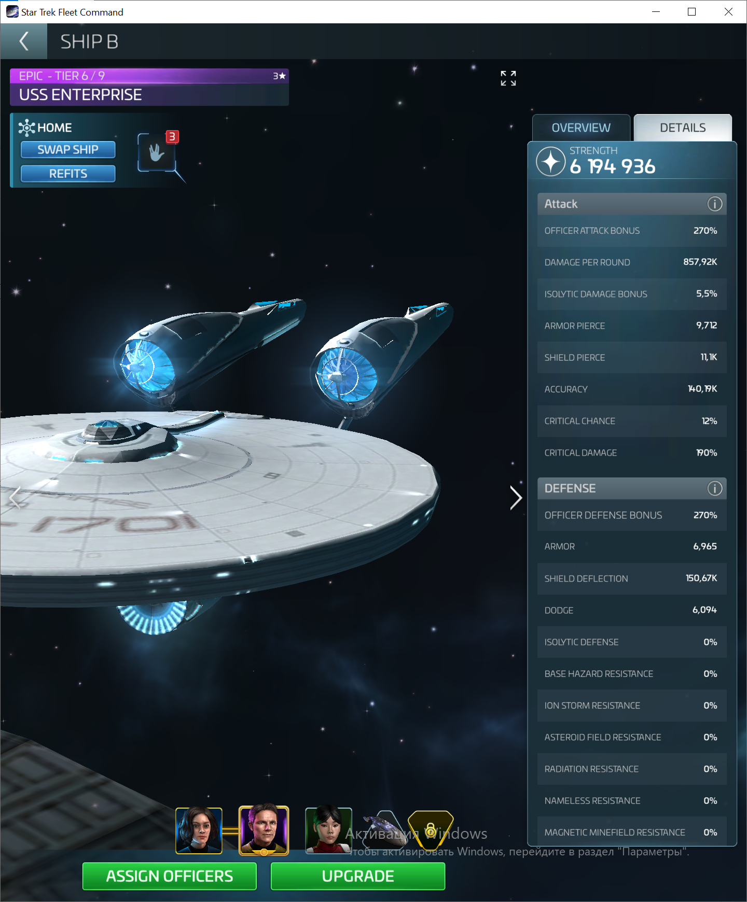
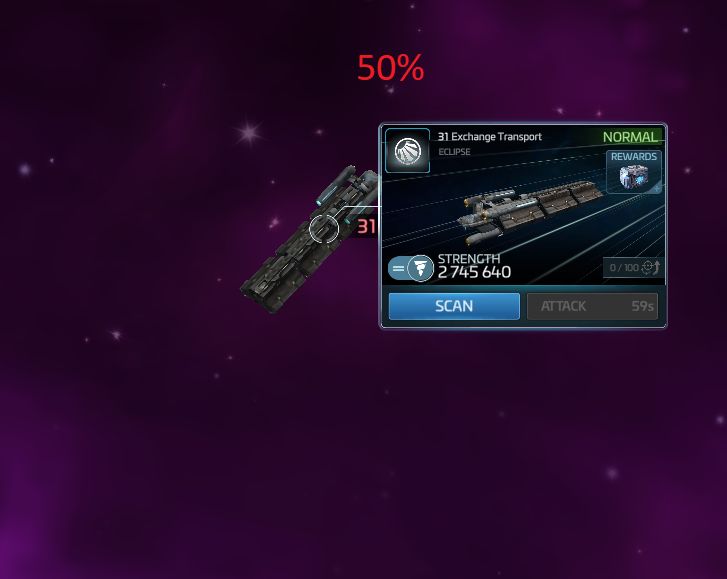
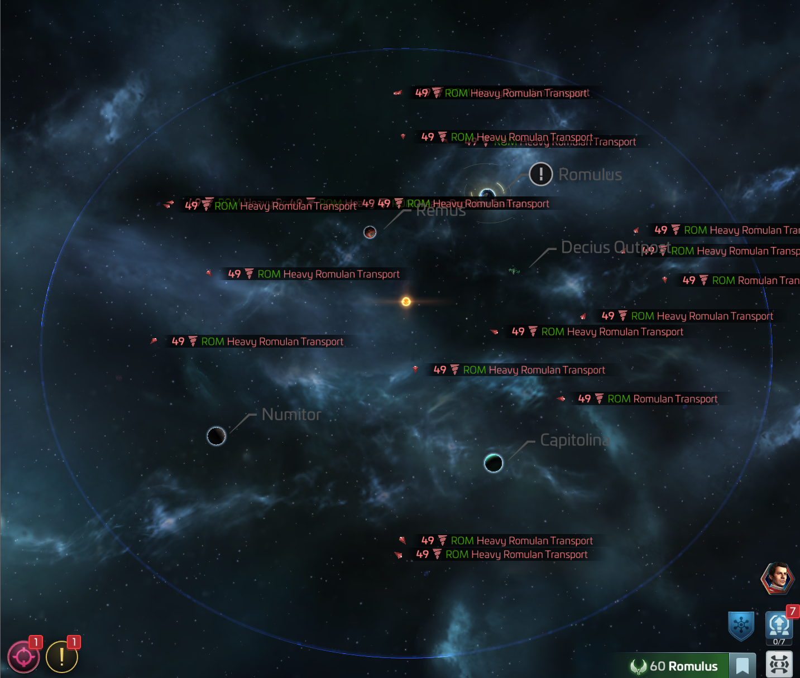

# Transformers plugin/mod for Star Trek Fleet Command™ game client
Tested with STFC client v1.000.41004 (Update 75.2.0)
Designed to use with [BepInEx.Legacy](https://github.com/Plurimus/BepInEx.Legacy) framework
Recommended to use with [BepInExConfigManager.Il2Cpp](https://github.com/sinai-dev/BepInExConfigManager) plugin as ingame settings editor

## What it does
This mod changes some interface windows/pop-ups/menus:
- Extended speedups inventory popup menu
- Extended combat report window
- Extended ship management stats window
- Change pop-up object viewer scale (ships, systems, armadas)
- Always show names and tags of ships on any zoom
  
## How to install
- unpack BepInEx framework release archive into STFC game folder which is usually located at `C:\Games\Star Trek Fleet Command\Star Trek Fleet Command\default\game`
- run the game client and wait until BepInEx will make unhollowed assemblies in `..\BepInEx\unhollowed\` folder
- unpack Optimus.STFC.Transformers archive to BepInEx folder so it will copy `Optimus.STFC.Transformers.dll` to `C:\Games\Star Trek Fleet Command\Star Trek Fleet Command\default\gameBepInEx\plugins\`
- make a link file to `prime.exe` and start the game client with it to avoid automatic updates 

## Used libraries
- [BepInEx/BepInEx.IL2CPP](https://nuget.bepinex.dev/packages/BepInEx.IL2CPP) - v6.0.0-pre.1
- [BepInEx/BepInEx.PluginInfoProps](https://nuget.bepinex.dev/packages/BepInEx.PluginInfoProps) - v2.1.0

## Result screenshots

